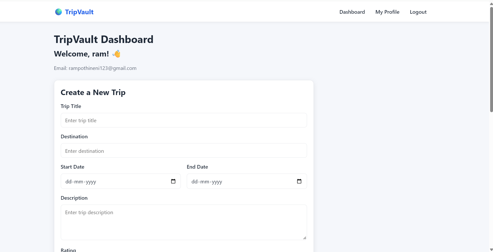

# 🌍 TripVault

TripVault is a full-stack MERN travel memory journal that allows users to create and manage trips, upload travel photos, maintain personal profiles, and share public travel profiles.

🔗 **Live Demo:** https://tripvault-theta.vercel.app/

💻 **GitHub Repository:** https://github.com/simhadrinsimhadrin02-creator/tripvault

---

## 📸 Project Preview



---

## 🚀 Features

### 🔐 Authentication

- User registration
- Username-based registration
- Secure password hashing using bcryptjs
- JWT-based authentication
- Login and logout
- Protected routes
- Authenticated user information

### 🧳 Trip Management

- Create trips
- View trip details
- Edit trips
- Delete trips
- Trip title and destination
- Start and end dates
- Trip description
- Trip rating
- Personal trip dashboard

### 📸 Photo Uploads

- Upload travel photos
- Cloudinary image storage
- Multer-based image upload
- JPG, PNG and WEBP support
- 5 MB image size limit
- Trip cover image
- Multiple photos per trip
- Responsive photo gallery

### 👤 User Profiles

- Unique usernames
- Personal profile
- Public profile pages
- Profile bio
- Edit profile
- Update bio
- Display user's trips
- Public trip information

### 🎨 UI & Responsive Design

- Responsive layout
- Mobile-friendly navigation
- Hamburger menu on small screens
- Responsive trip cards
- Responsive forms
- Responsive photo galleries
- Loading states
- Empty states
- Error messages
- Toast notifications
- Consistent styling
- Footer with GitHub link

---

## 🛠️ Tech Stack

### Frontend

- React
- Vite
- React Router
- Axios
- CSS
- React Toastify

### Backend

- Node.js
- Express.js
- MongoDB
- Mongoose
- JWT
- bcryptjs
- CORS
- dotenv
- Multer

### Image Storage

- Cloudinary

### Deployment

- Vercel — Frontend
- Render — Backend
- MongoDB Atlas — Database
- Cloudinary — Image Storage

---

## 📁 Project Structure

```text
tripvault/
│
├── client/
│   ├── src/
│   │   ├── components/
│   │   │   ├── Navbar.jsx
│   │   │   └── Footer.jsx
│   │   │
│   │   ├── pages/
│   │   │   ├── Login.jsx
│   │   │   ├── Register.jsx
│   │   │   ├── Dashboard.jsx
│   │   │   ├── TripDetails.jsx
│   │   │   ├── Profile.jsx
│   │   │   └── EditProfile.jsx
│   │   │
│   │   ├── App.jsx
│   │   ├── main.jsx
│   │   └── index.css
│   │
│   ├── .env
│   ├── vercel.json
│   └── package.json
│
├── server/
│   ├── models/
│   │   ├── User.js
│   │   └── Trip.js
│   │
│   ├── routes/
│   │   ├── auth.js
│   │   ├── trips.js
│   │   └── userRoutes.js
│   │
│   ├── middleware/
│   │   ├── authMiddleware.js
│   │   └── upload.js
│   │
│   ├── uploads/
│   ├── index.js
│   └── package.json
│
├── screenshots/
│   ├── dashboard.png
│   └── Screenshot 2026-09-25 233343.png
│
├── .gitignore
└── README.md